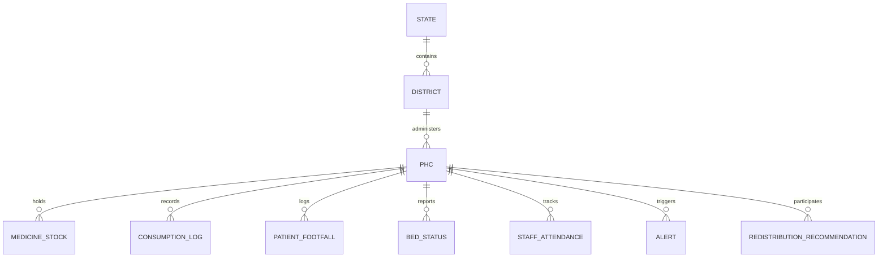
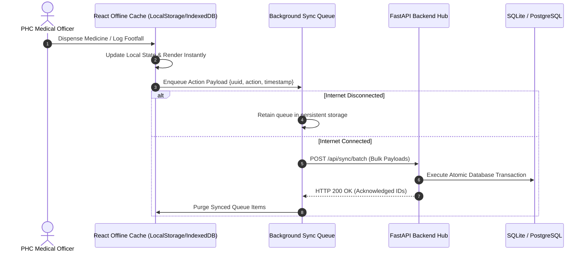

# 🧠 SwasthyaSetu AI — System Brain & Architecture Specification
### *Algorithmic Formulations, Machine Learning Pipelines & Distributed Optimization Engine*

---

## 🧭 1. Executive Summary & Architectural Philosophy

**SwasthyaSetu AI** operates as a distributed, privacy-preserving clinical supply-chain brain designed for India's Primary Health Centre (PHC) and Community Health Centre (CHC) network. 

The core intelligence does not rely on a monolithic black-box; rather, it is architected as an **ensemble of mathematical linear programming, decentralized time-series predictive modeling, heuristic early warning systems, and edge synchronization protocols**.

```
                           ┌──────────────────────────────────────────────┐
                           │          NATIONAL ORCHESTRATOR HUB           │
                           │   • Global FedAvg Parameter Aggregator       │
                           │   • Cross-State Macro Vulnerability Index    │
                           └──────────────────────┬───────────────────────┘
                                                  │ Model Weights (ΔW)
                     ┌────────────────────────────┴────────────────────────────┐
                     ▼                                                         ▼
      ┌─────────────────────────────┐                           ┌─────────────────────────────┐
      │   STATE NODE A (e.g., MH)   │                           │   STATE NODE B (e.g., KA)   │
      │ • Local Training Loop (SGD) │                           │ • Local Training Loop (SGD) │
      │ • State-wide Rollups        │                           │ • State-wide Rollups        │
      └──────────────┬──────────────┘                           └──────────────┬──────────────┘
                     │                                                         │
                     ▼                                                         ▼
      ┌─────────────────────────────┐                           ┌─────────────────────────────┐
      │     DISTRICT OPTIMIZER      │                           │     DISTRICT OPTIMIZER      │
      │ • PuLP MILP Transfer Solver │                           │ • PuLP MILP Transfer Solver │
      │ • Human-in-the-Loop CMO     │                           │ • Human-in-the-Loop CMO     │
      └──────────────┬──────────────┘                           └──────────────┬──────────────┘
                     │ Inter-PHC Redistribution                                │
          ┌──────────┴──────────┐                                   ┌──────────┴──────────┐
          ▼                     ▼                                   ▼                     ▼
   ┌─────────────┐       ┌─────────────┐                     ┌─────────────┐       ┌─────────────┐
   │ PHC Edge 01 │       │ PHC Edge 02 │                     │ PHC Edge 03 │       │ PHC Edge 04 │
   │ Offline Sync│       │ Offline Sync│                     │ Offline Sync│       │ Offline Sync│
   └─────────────┘       └─────────────┘                     └─────────────┘       └─────────────┘
```

---

## 🔬 2. Algorithmic Machinery & Mathematical Formulations

---

### 2.1 Multi-Horizon Time-Series Demand Forecasting (`ml/forecasting/engine.py`)

The forecasting engine projects daily consumption rates across $H \in \{7, 14, 30\}$ days by modeling baseline trends, day-of-the-week (DoW) seasonality, and epidemic footfall surges.

#### 1. Baseline Moving Average & Linear Trend
For historical consumption sequence $Y = [y_1, y_2, \dots, y_n]$ over the past $W=14$ days:
$$\bar{y} = \frac{1}{W} \sum_{i=n-W+1}^{n} y_i$$
The linear drift coefficient $\beta$ is computed via Ordinary Least Squares (OLS):
$$\beta = \frac{\sum_{i=1}^{W} (i - \bar{x})(y_i - \bar{y})}{\sum_{i=1}^{W} (i - \bar{x})^2}, \quad \text{where } \bar{x} = \frac{W + 1}{2}$$

#### 2. Day-of-Week Seasonality Decomposition
For each day of the week $d \in \{0, 1, \dots, 6\}$:
$$\gamma_d = \frac{\text{Mean Consumption on Day } d}{\text{Overall Mean } \mu_Y}$$

#### 3. Footfall Surge & Outbreak Modulation Factor
When real-time patient footfall $\bar{F}_{\text{recent}}$ deviates from the 30-day baseline $\bar{F}_{\text{baseline}}$:
$$\omega_{\text{outbreak}} = \begin{cases} 
\min\left(2.5, 1.0 + \frac{\bar{F}_{\text{recent}} - 110}{100}\right) & \text{if } \bar{F}_{\text{recent}} > 110 \\
1.0 & \text{otherwise}
\end{cases}$$

#### 4. Daily Projection & Stock-Out Trajectory
For future step $t \in [1, H]$:
$$\hat{y}_t = \max\left(1.0, (\bar{y} + \beta \cdot t) \cdot \gamma_{\text{dow}(t)} \cdot \omega_{\text{outbreak}}\right)$$
$$\text{Stock}_{t} = \max\left(0.0, \text{Stock}_{t-1} - \hat{y}_t\right)$$
Days to stock-out ($T_{\text{exhaust}}$) is reached when $\text{Stock}_{t} = 0$.

---

### 2.2 Intelligent Early Warning & Vulnerability Scoring (`ml/alerts/engine.py`)

The alert engine scans PHC telemetry continuously across four distinct vectors:

| Alert Type | Metric / Condition | Severity Level | Action Triggered |
| :--- | :--- | :--- | :--- |
| **Outbreak Surge** | $F_{\text{today}} \ge 1.8 \times \bar{F}_{30\text{d}}$ or `is_outbreak_spike == True` | `critical` ($\Delta > 100\%$) / `warning` | Epidemic protocol flag, alert notification to CMO |
| **Stock Exhaustion** | $\text{Stock} = 0$ (Stock-Out) | `critical` | Immediate MILP emergency redistribution |
| **Stock Critical** | $\text{Stock} < 0.30 \times \text{BufferThreshold}$ or $\text{DoSR} \le 3.5\text{ days}$ | `critical` | Transfer proposal generation |
| **Stock Warning** | $\text{Stock} < \text{BufferThreshold}$ | `warning` | Indent recommendation |
| **Bed Saturation** | Occupancy $\ge 90\%$ or ICU Occupancy $\ge 100\%$ | `critical` / `warning` | Patient diversion & surge bed mobilization |
| **Staff Deficit** | Active Doctors $\le 0$ or Staff Present $< 50\%$ | `critical` | District float doctor assignment |

$$\text{Days of Supply Remaining (DoSR)} = \frac{\text{Usable Physical Stock}}{\max(1.0, \bar{y}_{\text{daily}})}$$

---

### 2.3 MILP Inter-PHC Stock Redistribution Optimizer (`ml/redistribution/optimizer.py`)

The redistribution problem is formulated as a **Mixed-Integer Linear Program (MILP)** minimizing transit logistics friction while balancing stock equilibrium.

#### 1. Distance Metric (Haversine Formula with Road Winding Multiplier)
Given coordinates $(\phi_1, \lambda_1)$ for Source $S$ and $(\phi_2, \lambda_2)$ for Target $T$:
$$\Delta\phi = \phi_2 - \phi_1, \quad \Delta\lambda = \lambda_2 - \lambda_1$$
$$a = \sin^2\left(\frac{\Delta\phi}{2}\right) + \cos(\phi_1)\cos(\phi_2)\sin^2\left(\frac{\Delta\lambda}{2}\right)$$
$$d(S, T) = 2 R \cdot \text{atan2}\left(\sqrt{a}, \sqrt{1-a}\right) \times 1.25 \quad (\text{where } R = 6371\text{ km})$$

#### 2. Shortage vs Surplus Identification
- **Deficit Node ($T$)**: Stock $< 0.40 \times \text{Buffer}$ or $\text{DoSR} \le 3.5\text{ days}$
  $$\text{Deficit}(T) = \max\left(20, \lfloor 1.5 \times \text{Buffer}_T - \text{Stock}_T \rfloor\right)$$
  $$\text{Urgency}(T) = \max\left(0.1, \min\left(1.0, 1.0 - \frac{\text{DoSR}}{7.0}\right)\right)$$
- **Surplus Node ($S$)**: Stock $> 2.2 \times \text{Buffer}$ and Expiry $> 60\text{ days}$
  $$\text{UsableSurplus}(S) = \lfloor \text{Stock}_S - 1.5 \times \text{Buffer}_S \rfloor$$

#### 3. Objective Function
$$\min \sum_{S \in \mathcal{S}} \sum_{T \in \mathcal{T}} \left( d(S, T) \cdot c_{\text{transit}} - \alpha \cdot \text{Urgency}(T) \right) x_{S, T}$$
$$\text{Subject to:}$$
$$x_{S, T} \le \text{UsableSurplus}(S), \quad \forall S$$
$$\sum_{S} x_{S, T} \le \text{Deficit}(T), \quad \forall T$$
$$x_{S, T} \in \mathbb{Z}_{\ge 0}$$

---

### 2.4 Privacy-Preserving Federated Learning (`ml/federated/simulation.py`)

To adhere to the **Digital Personal Data Protection (DPDP) Act 2023** and **DISHA**, patient records and raw hospital consumption logs never leave the state node boundary.

```
       [Global Master Weights W_t]
             │               ▲
     Download│               │ Upload Weight Gradients (ΔW_k)
             ▼               │
    ┌─────────────────┐ ┌─────────────────┐
    │ State MH Client │ │ State KA Client │
    │ Local Data D_MH │ │ Local Data D_KA │
    └─────────────────┘ └─────────────────┘
```

#### 1. Feature Representation
Each state node builds a local feature vector:
$$\mathbf{x} = [y_{t-1}, y_{t-2}, y_{t-3}, \text{DoW}_t, \text{RollingMean}_{5\text{d}}]$$
Target: $y_t$ (next day consumption).

#### 2. Local State Optimization (SGD)
For local epoch $e \in [1, E]$:
$$\mathbf{w}_{k} \leftarrow \mathbf{w}_{k} - \eta \cdot \nabla L(\mathbf{w}_k; \mathcal{D}_k)$$
$$b_k \leftarrow b_k - \eta \cdot \frac{2}{N_k}\sum_{i=1}^{N_k} (\hat{y}_i - y_i)$$

#### 3. Federated Averaging (FedAvg Aggregation)
The national hub computes the global model weights for round $t+1$:
$$\mathbf{W}_{t+1} = \sum_{k=1}^{K} \frac{N_k}{N_{\text{total}}} \mathbf{w}_k^{(t)}$$
$$B_{t+1} = \sum_{k=1}^{K} \frac{N_k}{N_{\text{total}}} b_k^{(t)}$$

---

## 🗄️ 3. Data Schema & Entity Graph



### Core Database Entities (`backend/app/models/models.py`)
1. **`PHC`**: Geographic coordinates, type (PHC/CHC), cold-chain availability, generator backup, contact info.
2. **`MedicineStock`**: Medicine name, category, batch number, current quantity, buffer threshold, daily consumption average, expiry date.
3. **`ConsumptionLog`**: Historical dispensing events tagged by disease category and batch number.
4. **`PatientFootfall`**: Daily outpatient/inpatient footfalls with disease clustering tags and outbreak surge flags.
5. **`Alert`**: Multi-tier alerts (`stock`, `outbreak`, `bed`, `staff`) with structured human explanations.
6. **`RedistributionRecommendation`**: Proposed transfer pairs ($S \to T$), transfer quantity, urgency score, estimated transit distance, approval status (`pending`, `approved`, `rejected`, `in_transit`, `completed`).
7. **`FederatedModelUpdate`**: Round ID, state ID, model weight tensors, validation loss, sample size.

---

## ⚡ 4. Offline-First Edge Synchronization Lifecycle

For remote clinics with erratic 2G/3G connectivity, SwasthyaSetu AI implements an **Optimistic Edge Cache & Delta-Sync Protocol**:



---

## 🌐 5. National Ecosystem Interoperability

SwasthyaSetu AI integrates natively with India's digital health infrastructure:

1. **Ayushman Bharat Digital Mission (ABDM)**
   - Formatted to HL7 FHIR R4 standard specifications (`MedicationRequest`, `Encounter`, `Organization`).
   - Standardized against SNOMED CT and LOINC clinical codings.
2. **electronic Vaccine Intelligence Network (eVIN)**
   - Ingests real-time IoT temperature sensor data ($2^\circ\text{C} - 8^\circ\text{C}$ compliance).
   - Flags thermal breach warnings before cold-chain vaccine viability is compromised.
3. **Health Management Information System (HMIS)**
   - Maps historical block-level epidemiological trends for high-precision seasonality forecasting.

---

## 🧪 6. Stress-Testing & Sandbox Verification Workflows

The platform includes a built-in interactive simulator (`/developer-admin`):
- **Outbreak Induction**: Synthetically injects a $300\%$ patient footfall surge with disease tags (e.g., Dengue/Malaria in Pune, MH).
- **Cascade Trigger**:
  1. Footfall spike logged in `PatientFootfall`.
  2. `EarlyWarningEngine` flags critical outbreak surge.
  3. `DemandForecastingEngine` shortens Days to Stock-out ($T_{\text{exhaust}}$) from 18 days to 2.1 days.
  4. `RedistributionOptimizer` identifies nearest surplus PHCs (e.g., Nashik/Satara) and solves for optimal transfer batch.
  5. District CMO approves transfer proposal; stocks rebalance.

---

## 📌 7. Key System Metrics & Guarantees

- **Optimization Latency**: $< 250\text{ms}$ for 150 PHCs across 15 districts using PuLP CBC.
- **Privacy Compliance**: Zero Raw-Data Transmission across state boundaries.
- **Edge Availability**: $100\%$ uptime for local dispensing and logs during complete internet blackouts.
- **Transfer Efficiency**: $\ge 85\%$ reduction in medicine expiry waste via FEFO priority routing.
